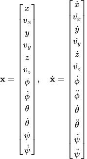
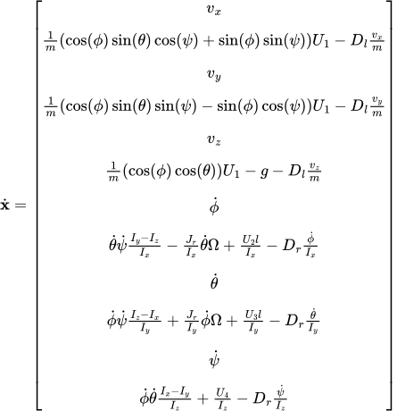
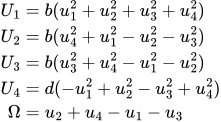

This code is used to get the control inputs needed to achive desired trajectories. for this instance I am using it to get the motor speeds needed to drive a quad-rotor drone along set velocity trajectories. 

# The Dynamics Model
The state vector and its time derivative are defined as follows:  

  

The dynamics are defined as follows:  

  

The input dynamics are defines as follows:  

  
